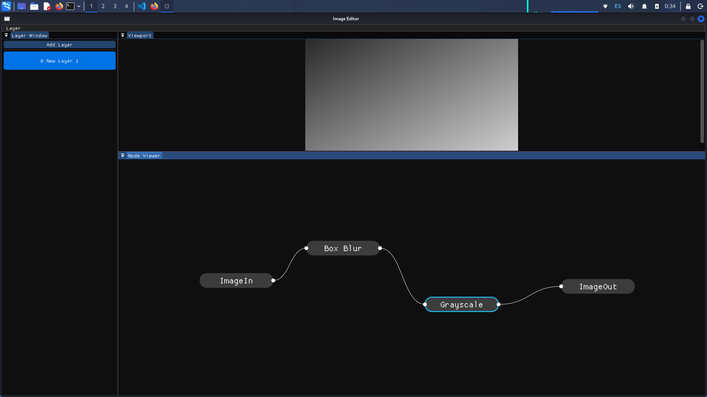

# PRISMA
---
## What is Prisma?
Prisma is a **node-based image editor**.

A Prisma project is built upon **layers** that contain **nodes**. The nodes generate an image which is **composed and mixed with the other layers**. The **highest layer** is the image that is on the front and the lowest layer is the layer that is on the back.

**NOTE:** It is currently a **prototype** and it is not intended for general use. It is very limited at the moment, and only intended for demostration purposes. As you can see, it contains a beautiful node viewer where you can:
* Move
* Zoom, 
* Drag nodes
* Connect nodes
* Create nodes **(right click && select node type)** 
* Delete nodes **(del)**

## Dependencies
* At least **CMake 4.3**
* **Make**
* **SDL3** installed on your computer
* **Dear ImGui** (The source code already includes the header files so no need to install it independently)

# A screenshot of Prisma
---
